# Sprint 3 – System Design Report

**Project:** Meetolog — Meeting-to-Backlog AI System  
**Course:** Capstone Project  
**Date:** March 12, 2025  
**Repository:** https://github.com/<org>/meetolog  
**Deployed Frontend:** Vercel (Next.js)  
**Deployed Backend:** AWS ECS Fargate

---

## Table of Contents

1. [Technology Stack](#1-technology-stack)  
2. [System Architecture](#2-system-architecture)  
3. [Functionalities and APIs](#3-functionalities-and-apis)  
4. [Algorithms of Core Functions](#4-algorithms-of-core-functions)  
5. [System Interaction and Behaviour](#5-system-interaction-and-behaviour)  
6. [GUI Design](#6-gui-design)  

---

## 1. Technology Stack

This section enumerates every library, framework, and managed service that constitutes the Meetolog system. Each entry includes the precise version pinned in the lockfiles and a rationale grounded in the project's requirements: processing long meeting recordings, extracting structured backlog artefacts via large-language models, and deploying the result as a cloud-native web application.

### 1.1 Backend Runtime and Framework

| Component | Version | Role |
|---|---|---|
| **Python** | 3.11+ | Primary backend language. Selected for its dominance in ML/NLP tooling and first-class async support via `asyncio`. |
| **FastAPI** | 0.109+ | Asynchronous HTTP framework. Chosen for automatic OpenAPI documentation, native Pydantic integration, and dependency-injection support that simplifies session management. |
| **Uvicorn** | 0.27+ | ASGI server process. Provides the production event loop that hosts the FastAPI application. |
| **Pydantic** | 2.x | Data validation and serialisation. v2's Rust-compiled core yields sub-millisecond validation of complex nested artefact schemas. |
| **Pydantic-Settings** | 2.x | Twelve-factor configuration loading. Reads environment variables and `.env` files into a typed `Settings` singleton. |

### 1.2 Speech Processing

| Component | Version | Role |
|---|---|---|
| **OpenAI Whisper** | latest | Local speech-to-text model. Running on-device avoids per-minute API costs and permits offline development. The `tiny` model is used by default to maintain low memory consumption on constrained workers. |
| **pyannote.audio** | 3.1 | Speaker diarisation pipeline (`pyannote/speaker-diarization-3.1`). Produces a global speaker timeline that is aligned with Whisper segments by midpoint overlap. Requires a HuggingFace gated-model token. |
| **ffmpeg** (system) | — | Audio decoding, mono conversion (16 kHz PCM), and fixed-duration segmentation. Invoked as a subprocess to avoid loading decoded waveforms into Python memory. |

### 1.3 Large-Language-Model Integration

| Component | Version | Role |
|---|---|---|
| **Google Generative AI SDK** (`google-generativeai`) | 0.8+ | Client for Google Gemini models. Default production provider (model: `gemini-2.5-flash-lite`). |
| **OpenAI Python SDK** (`openai`) | 1.x | Client for OpenAI models (model: `gpt-4o-mini`). Used as an alternative provider. |
| **tiktoken** | latest | Token-count estimation with the `cl100k_base` encoding. Drives chunk-size budgets in the hierarchical summarisation and context-compression pipelines. |
| **json-repair** | latest | Best-effort recovery of malformed JSON that LLMs occasionally emit (trailing commas, unescaped quotes). Applied before Pydantic validation. |
| **tenacity** | 8.x | Declarative retry logic with exponential back-off. Wraps every LLM API call to absorb transient 429/5xx errors. |

### 1.4 Retrieval-Augmented Generation (RAG)

| Component | Version | Role |
|---|---|---|
| **NumPy** | 1.x | Default in-memory vector store. Embedding matrices are held as `float32` arrays; cosine similarity is computed as a dot product on L2-normalised vectors. |
| **pgvector** | 0.3+ | PostgreSQL extension for persistent vector storage. Provides the `vector` column type and the `<=>` cosine-distance operator. Used when `RAG_BACKEND=pgvector`. |
| **OpenAI Embeddings API** | — | Embedding model `text-embedding-3-small` (1 536 dimensions). Used when `LLM_PROVIDER=openai`. |
| **Gemini Embedding API** | — | Embedding model `text-embedding-004` (768 dimensions). Used when `LLM_PROVIDER=gemini`. |

### 1.5 Data Layer

| Component | Version | Role |
|---|---|---|
| **PostgreSQL** | 15 | Relational store for job records, artefact JSON, and (optionally) vector embeddings. Chosen for its mature `SELECT … FOR UPDATE SKIP LOCKED` primitive, which powers the distributed job queue without external brokers. |
| **SQLAlchemy** | 2.0 (async) | ORM and connection-pool manager. Async engine with `asyncpg` driver; pool of 10 connections with overflow to 20. |
| **asyncpg** | latest | Native async PostgreSQL driver for SQLAlchemy 2.0. |
| **Alembic** | 1.x | Database migration manager. Four migration scripts track the schema from initial job-tracking through pgvector embeddings. |
| **aioboto3** | latest | Async wrapper over boto3 for S3 object operations (presigned URLs, multipart uploads, downloads). |

### 1.6 Document Generation

| Component | Version | Role |
|---|---|---|
| **ReportLab** | 4.x | PDF generation library. Produces letter-sized reports with custom paragraph styles, tables for tasks and blockers, and a cover page with meeting metadata. |

### 1.7 Frontend

| Component | Version | Role |
|---|---|---|
| **Next.js** | 16.1.6 | React meta-framework. Provides server-side rendering, file-system routing, and API-route rewrites that proxy `/api/*` to the backend. |
| **React** | 18.2 | Component library. Used exclusively with functional components and hooks (`useState`, `useEffect`, `useRef`, `useCallback`). |
| **TypeScript** | 5.3 | Statically typed superset of JavaScript. Enforced across all frontend source files. |
| **CSS Modules** | (built-in) | Scoped styling. Each component imports a `.module.css` file; class names are hashed at build time to prevent collisions. |
| **Jest + React Testing Library** | latest | Unit and integration test runner for frontend components and API utilities. |

### 1.8 Infrastructure and DevOps

| Component | Purpose |
|---|---|
| **AWS ECS Fargate** | Serverless container orchestration. Two task definitions: `meetolog-api` (0.25 vCPU / 512 MB) and `meetolog-worker` (1 vCPU / 2 048 MB, Fargate Spot). |
| **AWS Application Load Balancer** | TLS termination and HTTP routing to the API service. |
| **AWS RDS PostgreSQL** | Managed database (`db.t3.micro`) with pgvector extension. |
| **AWS S3** | Object storage for uploaded audio files, generated PDFs, and artefact JSON snapshots. |
| **AWS ECR** | Private container registry for Docker images. |
| **AWS SSM Parameter Store** | Secure storage for secrets (`DATABASE_URL`, `GEMINI_API_KEY`, `AWS_S3_BUCKET`, `CORS_ORIGINS`). Injected into ECS tasks at launch. |
| **AWS CloudWatch Logs** | Centralised log aggregation. Each ECS task streams structured JSON logs to a dedicated log group. |
| **Vercel** | Frontend hosting with automatic deployments from the main branch. |
| **Docker / Docker Compose** | Local development environment. Compose orchestrates PostgreSQL 15, Redis 7 (reserved), and MinIO (S3-compatible) alongside the backend. |

### 1.9 Observability and Resilience

| Component | Role |
|---|---|
| **structlog** | Structured JSON logging. Configured with timestamper, log-level filter, and JSON renderer. Every log entry is machine-parseable for CloudWatch Insights queries. |
| **tenacity** | Retry with exponential back-off on all LLM and S3 calls. |
| **asyncio.timeout** | 60-second deadline on individual LLM invocations to prevent worker stalls. |
| **Stale-lock recovery** | The job queue reclaims jobs locked for more than 7 200 seconds (2 hours), allowing another worker to retry. |

---

## 2. System Architecture

### 2.1 High-Level Component Diagram

The system follows a **three-tier architecture** with a clear separation between the presentation layer (Next.js SPA), the application layer (FastAPI API + background workers), and the data layer (PostgreSQL + S3).

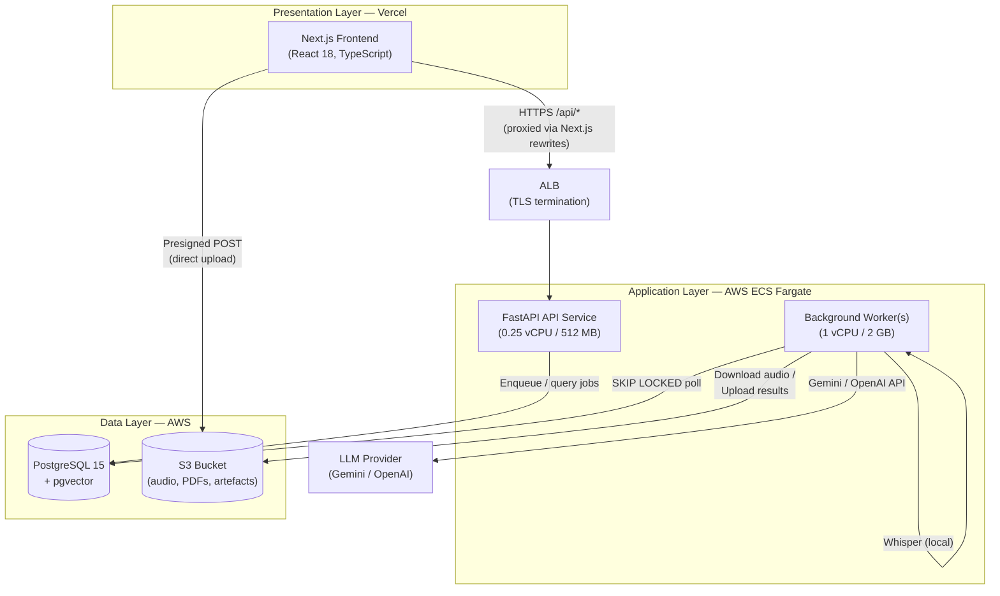

### 2.2 Service Decomposition

The backend is structured as a layered Python package under `backend/app/`:

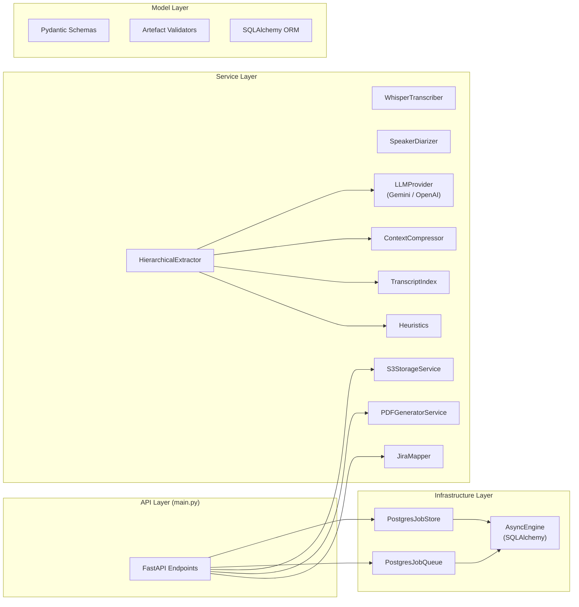

### 2.3 Backend Package Structure

```
backend/app/
├── main.py                 # FastAPI application, endpoint definitions, lifespan
├── worker.py               # Async polling worker, full processing pipeline
├── config.py               # Pydantic Settings (30+ env vars, @lru_cache)
├── interfaces.py           # ABCs: JobStore, Transcriber, LLMExtractor
├── core/
│   ├── prompts.py          # Prompt templates (6 domains)
│   └── logger.py           # structlog configuration
├── services/
│   ├── transcription.py    # WhisperTranscriber (chunked, singleton model)
│   ├── diarization.py      # SpeakerDiarizer (pyannote 3.1)
│   ├── llm_extraction.py   # HierarchicalExtractor (orchestrator)
│   ├── llm_engine.py       # GeminiProvider, OpenAIProvider (strategy)
│   ├── compression.py      # ContextCompressor (algorithmic)
│   ├── rag_retrieval.py    # TranscriptIndex, build_index, retrieve
│   ├── heuristics.py       # Deterministic confidence scoring
│   ├── transcript_index.py # PgVectorIndex (persistent RAG backend)
│   ├── pdf_generator.py    # ReportLab PDF generation
│   ├── jira_mapper.py      # Artefact-to-Jira export mapper
│   └── storage.py          # S3StorageService (async aioboto3)
├── models/
│   ├── schemas.py          # Pydantic v2 models (7 artefact types)
│   ├── artifacts.py        # LLM response validation pipeline
│   ├── db_models.py        # SQLAlchemy ORM (JobRecord)
│   └── metadata.py         # Meeting metadata model
├── infrastructure/
│   ├── db.py               # Async engine factory, session dependency
│   ├── postgres_job_store.py  # JobStore implementation
│   └── postgres_queue.py      # SKIP LOCKED job queue
└── utils/
    ├── audio.py            # ffmpeg split / convert / duration
    └── text_chunking.py    # Token-aware transcript chunking
```

### 2.4 Deployment Architecture

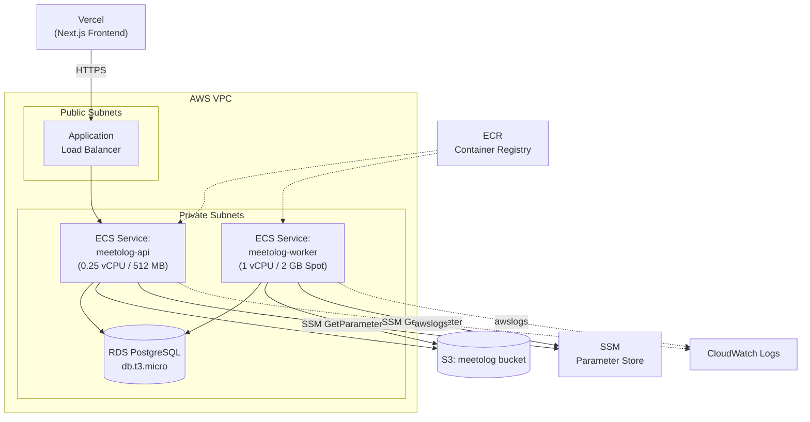

Key deployment decisions:

- **API and Worker separation.** The API task definition allocates minimal resources (0.25 vCPU) because it only handles HTTP routing and database queries. The worker task definition receives 1 vCPU and 2 GB of memory to accommodate the Whisper model, diarisation pipeline, and concurrent LLM calls.
- **Fargate Spot for workers.** Processing jobs are idempotent and retryable, making them safe to run on Spot capacity with up to 70% cost savings.
- **No external message broker.** The PostgreSQL `SELECT … FOR UPDATE SKIP LOCKED` pattern eliminates the operational overhead of Redis or SQS while providing exactly-once delivery semantics within the lock-timeout window.

### 2.5 Design Patterns

| Pattern | Application |
|---|---|
| **Strategy** | `LLMProvider` abstract base class with `GeminiProvider` and `OpenAIProvider` concrete implementations. The active provider is selected at startup via `settings.LLM_PROVIDER`. |
| **Repository** | `PostgresJobStore` implements the `JobStore` ABC, isolating all SQLAlchemy queries behind a domain-oriented interface. |
| **Template Method** | `HierarchicalExtractor.extract_artifacts()` defines the skeleton of the intelligence pipeline. Length-dependent conditional routing (short path vs. hierarchical path) is resolved inside the method. |
| **Singleton** | The Whisper model is loaded once into a module-level cache (`_model_cache`) and reused across transcription calls to avoid repeated disk I/O and memory allocation. |
| **Dependency Injection** | FastAPI's `Depends()` injects `AsyncSession`, `PostgresJobStore`, and `PostgresJobQueue` into endpoint handlers, simplifying testing and session lifecycle management. |
| **Map-Reduce** | Hierarchical summarisation fans out chunk summaries concurrently (Map) and recursively merges them (Reduce) until the result fits within the LLM context window. |

---

## 3. Functionalities and APIs

### 3.1 REST API Endpoints

The FastAPI application in `main.py` exposes ten HTTP endpoints. All endpoints return JSON unless otherwise noted.

#### 3.1.1 Health and Root

| Method | Path | Description |
|---|---|---|
| `GET` | `/` | Returns `{"status": "ok", "service": "meetolog-api"}`. Used for basic reachability probing. |
| `GET` | `/health` | Returns `{"status": "healthy", "database": "connected"}` after executing `SELECT 1` against PostgreSQL. Returns HTTP 503 if the database is unreachable. |

#### 3.1.2 Upload Flow

| Method | Path | Parameters | Response | Description |
|---|---|---|---|---|
| `POST` | `/upload/presign` | Body: `{ file_name: str, content_type: str }` | `{ url: str, fields: dict }` | Generates an S3 presigned POST. The frontend uploads directly to S3, bypassing the API for large files. Content-type is validated against an allow-list of audio MIME types. |
| `POST` | `/jobs/enqueue` | Body: `{ s3_key: str, file_name: str, file_size: int }` | `JobResponse` | Creates a `JobRecord` in `pending` state and returns the job ID. The worker will claim this job via the SKIP LOCKED queue. |
| `POST` | `/upload` | Multipart form: `file` (audio) | `JobResponse` | Legacy endpoint. Streams the file to S3 via `upload_stream()`, then enqueues the job. Retained for backward compatibility. |

#### 3.1.3 Job Management

| Method | Path | Parameters | Response | Description |
|---|---|---|---|---|
| `GET` | `/status/{job_id}` | Path: `job_id` (UUID) | `JobResponse` | Returns the current processing status, progress percentage, and error message (if any). The frontend polls this endpoint at 1-second intervals. |
| `GET` | `/artifacts/{job_id}` | Path: `job_id` (UUID) | `MeetingArtifacts` | Returns the extracted artefacts once the job reaches `completed` status. Returns 404 if the job does not exist or artefacts have not been persisted. |
| `PUT` | `/artifacts/{job_id}` | Path: `job_id` (UUID); Body: `MeetingArtifacts` | `JobResponse` | Overwrites the stored artefacts with user-edited values. Used by the inline artefact editor in the frontend. Validates the full Pydantic model before persisting. |

#### 3.1.4 Export

| Method | Path | Parameters | Response | Description |
|---|---|---|---|---|
| `GET` | `/download/{job_id}` | Path: `job_id` (UUID) | Redirect (302) or `{ url: str }` | Returns a short-lived S3 presigned GET URL for the generated PDF. The frontend opens this URL in a new tab. |
| `GET` | `/export/jira/{job_id}` | Path: `job_id` (UUID) | `{ projects: [...] }` | Maps artefacts to Jira's bulk-import JSON format. User stories become Story issues, execution tasks become Task issues, blockers become Bug issues, and decisions/action items become prefixed Task issues. |

### 3.2 Key Internal Service Functions

The following table documents the principal functions within the service layer. These are not HTTP-accessible but constitute the core intelligence pipeline invoked by the background worker.

#### `WhisperTranscriber.transcribe(audio_path: Path) -> str`

Splits the audio file into five-minute WAV chunks using ffmpeg's segment muxer, transcribes each chunk sequentially through the Whisper model in a thread pool, performs garbage collection between chunks, and concatenates the results into a single transcript string.

**Parameters:**
- `audio_path` (`Path`): Absolute path to the source audio file.

**Returns:** Plain-text transcript.

#### `WhisperTranscriber.transcribe_with_segments(audio_path: Path) -> list[dict]`

Same chunked pipeline as `transcribe()` but preserves per-segment timestamps (`start`, `end`, `text`). These segments are consumed by the diarisation alignment step.

#### `SpeakerDiarizer.diarize(audio_path: Path) -> list[DiarizedSegment]`

Loads the pyannote pipeline in a thread, converts the input to 16 kHz mono WAV if necessary, and runs inference to produce a list of `DiarizedSegment(speaker, start, end)` entries.

#### `SpeakerDiarizer.assign_speakers(whisper_segments, diarized_segments) -> str`

Static method. For each Whisper segment, computes the temporal midpoint and assigns the speaker label from the diarisation turn that contains that midpoint. Consecutive segments with the same speaker are merged. Returns a formatted transcript with speaker labels.

#### `HierarchicalExtractor.extract_artifacts(transcript, job_id, on_stage) -> MeetingArtifacts`

Public entry point for the intelligence pipeline. Accepts a transcript string, routes through either the short path or the hierarchical path based on a token-count threshold (default: 12 000 tokens), and returns a validated `MeetingArtifacts` object.

Short path (below threshold):
1. Build extraction prompt from template.
2. Call LLM provider.
3. Validate and parse response.

Hierarchical path (above threshold):
1. Chunk transcript into overlapping segments (6 000 tokens, 200-token overlap).
2. Concurrently execute Map-Reduce summarisation and RAG index construction via `asyncio.gather`.
3. Compress the summary via `ContextCompressor`.
4. For each of seven artefact categories, retrieve top-K relevant passages from the RAG index.
5. Build a RAG-augmented extraction prompt containing both the compressed summary and retrieved passages.
6. Call LLM provider, validate, parse, and backfill confidence scores.

#### `ContextCompressor.compress(text: str, token_budget: int) -> CompressionResult`

Purely algorithmic (no LLM calls). Segments the input on speaker turns or paragraph boundaries. Filters filler segments via regex. Scores remaining segments using weighted features (decision language 3.0×, temporal markers 2.5×, assignment patterns 2.5×, blocker indicators 2.5×, action verbs 2.0×, quantitative data 1.5×, named entities 1.0×). Greedily selects the highest-scoring segments until the token budget is exhausted, preserving original document order in the output.

#### `build_index(chunks, provider, settings) -> TranscriptIndex`

Factory function. Embeds transcript chunks via the configured embedding model (OpenAI `text-embedding-3-small` or Gemini `text-embedding-004`). Returns either a NumPy-backed `TranscriptIndex` or a persistent `PgVectorIndex` depending on `settings.RAG_BACKEND`.

#### `retrieve_all_artifact_contexts(index, provider, settings) -> dict[str, str]`

Fires seven parallel cosine-similarity queries (one per artefact category) against the index and returns a dictionary mapping each category to its concatenated top-K passages.

#### `calculate_artifact_confidence(artifact) -> float`

Deterministic scoring function. Base score 0.2; increments of +0.2 for: owner present, priority set, action verb detected, all schema fields populated. Decrement of −0.2 for ambiguity markers ("maybe", "possibly", "might"). Result is clamped to [0.0, 1.0].

#### `validate_llm_response(raw: str) -> LLMExtractionResponse`

Multi-stage validation pipeline: strip markdown fencing → `json.loads()` → fallback `json_repair.loads()` → Pydantic model validation. Converts the validated LLM-specific models into the canonical `MeetingArtifacts` schema via `to_meeting_artifacts()`.

### 3.3 Pydantic Data Models

The system defines seven artefact types inside `schemas.py`:

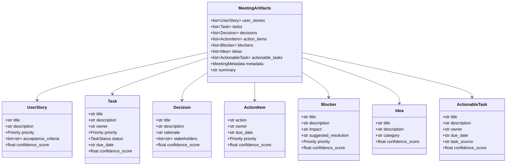

### 3.4 Database Schema

The single `job_records` table holds all job state:

| Column | Type | Purpose |
|---|---|---|
| `id` | `UUID` (PK) | Job identifier |
| `s3_key` | `VARCHAR` | S3 object key for the uploaded audio |
| `file_name` | `VARCHAR` | Original filename |
| `file_size` | `BIGINT` | File size in bytes |
| `status` | `VARCHAR` | Processing status enum value |
| `progress` | `INTEGER` | 0–100 percentage |
| `message` | `TEXT` | Human-readable status message |
| `error` | `TEXT` | Error details on failure |
| `artifacts` | `JSONB` | Serialised `MeetingArtifacts` |
| `pdf_url` | `VARCHAR` | Presigned URL (ephemeral) |
| `pdf_s3_key` | `VARCHAR` | Permanent S3 key for the generated PDF |
| `artifacts_s3_key` | `VARCHAR` | S3 key for the artefact JSON snapshot |
| `worker_id` | `VARCHAR` | ID of the worker that claimed the job |
| `locked_at` | `TIMESTAMP` | When the job was locked |
| `locked_by` | `VARCHAR` | Worker identity holding the lock |
| `attempts` | `INTEGER` | Number of processing attempts |
| `max_retries` | `INTEGER` | Retry ceiling (default 3) |
| `next_retry_at` | `TIMESTAMP` | Earliest time the job may be retried |
| `created_at` | `TIMESTAMP` | Job creation time |
| `updated_at` | `TIMESTAMP` | Last modification time |

A composite index on `(status, next_retry_at, created_at)` accelerates the `claim_next_job` query.

---

## 4. Algorithms of Core Functions

This section describes the non-trivial algorithms that constitute the intellectual core of Meetolog. Trivial CRUD operations and standard framework boilerplate are omitted.

### 4.1 Chunked Audio Transcription

The `WhisperTranscriber` addresses the memory constraint of running a Whisper model on resource-limited workers by decomposing the audio file into fixed-duration segments and transcribing them sequentially.

**Algorithm:**

```
FUNCTION transcribe(audio_path):
    chunks ← split_audio_into_chunks(audio_path, duration=300s)
    transcript ← ""
    FOR EACH chunk IN chunks:
        text ← run_in_thread(whisper_model.transcribe(chunk))
        transcript ← transcript + " " + text
        delete chunk from disk
        gc.collect()
    RETURN transcript
```

The `split_audio_into_chunks` function delegates to ffmpeg's segment muxer:

```
ffmpeg -i <input> -f segment -segment_time 300 -ar 16000 -ac 1 -c:a pcm_s16le <pattern>
```

This produces chronologically ordered 16 kHz mono WAV files. Each chunk is transcribed in a `ThreadPoolExecutor` (since Whisper's C++ backend releases the GIL), and explicit `gc.collect()` reclaims VRAM/RAM between chunks.

**Complexity:** O(n) in audio duration. Memory usage is bounded by one chunk's decoded waveform plus the Whisper model weights.

### 4.2 Speaker Diarisation Alignment

The diarisation module produces a global timeline of speaker turns, but the Whisper transcription produces independently timestamped text segments. The alignment algorithm maps each Whisper segment to the correct speaker.

**Algorithm:**

```
FUNCTION assign_speakers(whisper_segments, diarization_turns):
    labelled ← []
    FOR EACH seg IN whisper_segments:
        midpoint ← (seg.start + seg.end) / 2
        speaker ← find_turn_containing(midpoint, diarization_turns)
        IF speaker IS NULL:
            speaker ← find_nearest_turn(midpoint, diarization_turns)
        labelled.append((speaker, seg.text))

    // Merge consecutive segments from the same speaker
    merged ← []
    FOR EACH (speaker, text) IN labelled:
        IF merged IS NOT EMPTY AND merged.last.speaker == speaker:
            merged.last.text += " " + text
        ELSE:
            merged.append((speaker, text))

    RETURN format_as_transcript(merged)  // "SPEAKER_00: ..."
```

The midpoint heuristic is used because Whisper segment boundaries rarely align exactly with diarisation turn boundaries. The midpoint of a segment reliably falls within the speaker turn that dominates that segment's duration.

### 4.3 Hierarchical Summarisation (Map-Reduce)

When a transcript exceeds the configurable token threshold (default: 12 000 tokens), direct LLM extraction would either truncate the input or exceed the model's context window. The hierarchical summarisation algorithm addresses this through recursive Map-Reduce.

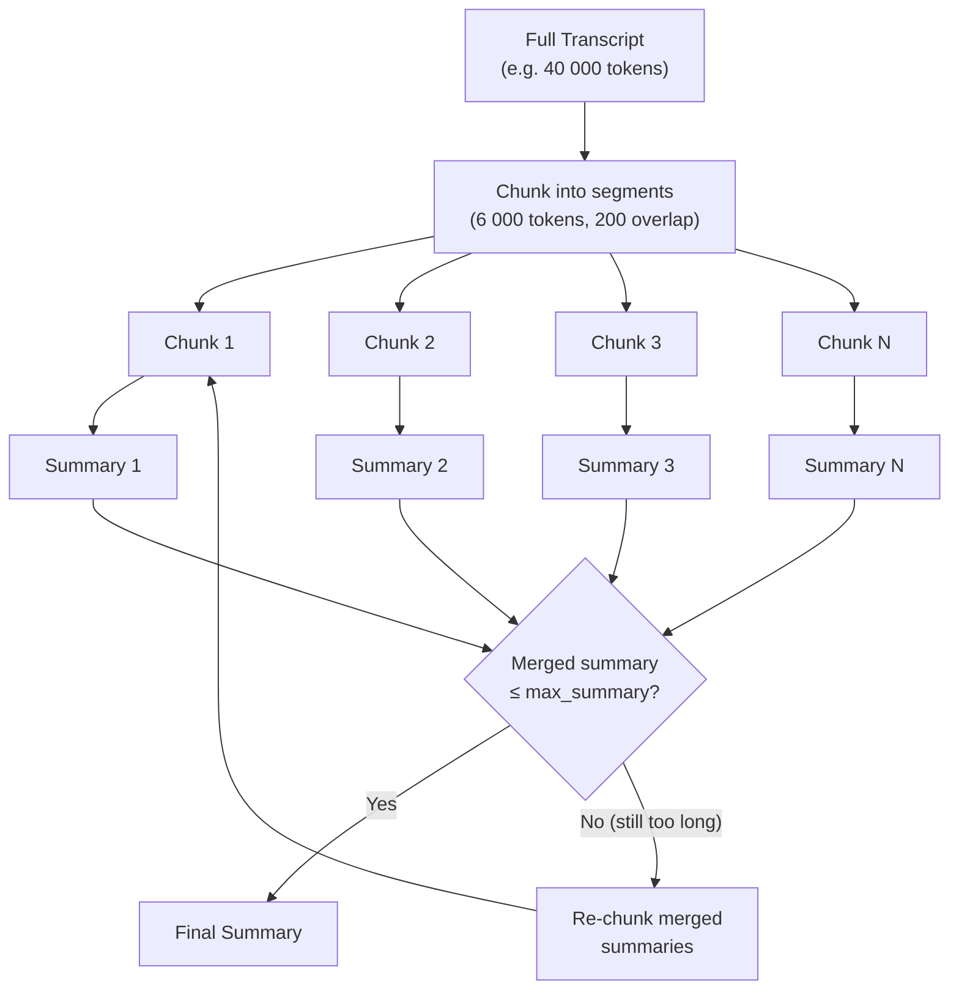

**Map phase:**

```
FUNCTION _hierarchical_summarize(transcript):
    chunks ← chunk_transcript(transcript, max_tokens=6000, overlap=200)
    semaphore ← Semaphore(concurrency=3)

    ASYNC FOR EACH chunk IN chunks (bounded by semaphore):
        summary ← llm_provider.generate_text(
            CHUNK_SUMMARIZATION_PROMPT.format(chunk=chunk)
        )

    merged ← join(summaries)

    // Reduce phase: recursive until within budget
    IF token_count(merged) > max_summary_tokens:
        RETURN _hierarchical_summarize(merged)  // recurse
    ELSE:
        RETURN merged
```

The Map phase processes chunks concurrently with a semaphore (default concurrency: 3) to bound parallel LLM API calls. Each chunk is summarised independently using the `CHUNK_SUMMARIZATION_PROMPT` template, which instructs the model to preserve decisions, action items, owners, dates, and technical details. The Reduce phase concatenates summaries and, if the result still exceeds the budget, recurses.

**Concurrency with RAG indexing:** The summarisation and RAG index construction run concurrently via `asyncio.gather`:

```python
summary, index = await asyncio.gather(
    self._hierarchical_summarize(transcript),
    build_index(chunks, self._provider, self._settings),
)
```

This overlaps network I/O (LLM summarisation calls and embedding API calls) to minimise end-to-end latency.

### 4.4 RAG Retrieval

The Retrieval-Augmented Generation system provides the LLM with targeted context relevant to each artefact category, improving extraction precision for long transcripts.

**Indexing:**

```
FUNCTION build_index(chunks, provider):
    embeddings ← []
    FOR EACH batch IN batches(chunks, size=64):
        batch_embeddings ← provider.embed(batch)
        embeddings.extend(batch_embeddings)

    // L2-normalise for cosine similarity via dot product
    FOR EACH vec IN embeddings:
        vec ← vec / ||vec||₂

    RETURN TranscriptIndex(chunks, numpy.array(embeddings))
```

**Retrieval:**

```
FUNCTION retrieve(index, query, top_k=5, max_tokens=3000):
    query_vec ← provider.embed(query)
    query_vec ← query_vec / ||query_vec||₂

    similarities ← index.embeddings @ query_vec   // dot product
    top_indices ← argsort(similarities, descending)[:top_k]

    result ← ""
    FOR EACH idx IN top_indices:
        IF token_count(result + index.chunks[idx]) > max_tokens:
            BREAK
        result += index.chunks[idx]
    RETURN result
```

**Per-category queries:** Seven hard-coded category-specific queries target different artefact types:

| Category | Query |
|---|---|
| User stories | "user requirements, feature requests, user needs, customer wants..." |
| Tasks | "task assignments, work items, development tasks, things to do..." |
| Decisions | "decisions made, agreed upon, resolved, conclusion reached..." |
| Action items | "action items, follow-up tasks, next steps, to-do..." |
| Blockers | "blockers, obstacles, impediments, risks, problems..." |
| Ideas | "ideas, suggestions, proposals, brainstorming, concepts..." |
| Actionable tasks | "specific actionable tasks, deliverables, milestones..." |

All seven queries execute concurrently via `asyncio.gather`, and each retrieves up to `top_k=5` passages with a `max_tokens=3000` budget.

### 4.5 Context Compression

The `ContextCompressor` reduces a long transcript or summary to fit within a token budget while preserving the most information-rich segments. It is purely algorithmic — no LLM calls.

**Algorithm:**

```
FUNCTION compress(text, budget=8000):
    segments ← split_on_speaker_turns_or_paragraphs(text)
    scored ← []

    FOR EACH segment IN segments:
        IF is_filler(segment):     // regex: "um", "uh", "you know", etc.
            CONTINUE

        score ← 0.0
        score += count_decision_keywords(segment)   × 3.0
        score += count_temporal_markers(segment)     × 2.5
        score += count_assignment_patterns(segment)  × 2.5
        score += count_blocker_indicators(segment)   × 2.5
        score += count_action_verbs(segment)         × 2.0
        score += count_quantitative_data(segment)    × 1.5
        score += count_named_entities(segment)       × 1.0

        scored.append((segment, score))

    // Greedy budget-constrained selection
    sorted_by_score ← sort(scored, by=score, descending)
    selected_indices ← []
    total_tokens ← 0

    FOR EACH (segment, score) IN sorted_by_score:
        tokens ← token_count(segment)
        IF total_tokens + tokens ≤ budget:
            selected_indices.append(original_index(segment))
            total_tokens += tokens

    // Restore original document order
    selected_indices.sort()
    result ← join(segments[i] for i in selected_indices)

    RETURN CompressionResult(
        compressed_text=result,
        original_tokens=token_count(text),
        compressed_tokens=total_tokens,
        ratio=total_tokens / token_count(text)
    )
```

The feature weights were tuned empirically. Decision language (3.0×) receives the highest weight because decisions are the scarcest and most valuable artefact type in typical meeting transcripts. Filler filtering uses a precompiled regex pattern matching common verbal fillers and hedging phrases.

### 4.6 Confidence Scoring (Heuristics)

Each extracted artefact receives a deterministic confidence score that quantifies how well-formed and actionable it is. This score is independent of the LLM's own certainty.

**Algorithm:**

```
FUNCTION calculate_artifact_confidence(artifact) -> float:
    score ← 0.2   // base score for existence

    IF artifact.owner IS NOT EMPTY:
        score += 0.2
    IF artifact.priority IS NOT NONE:
        score += 0.2
    IF text_contains_action_verb(artifact.title OR artifact.description):
        score += 0.2
    IF all_schema_fields_populated(artifact):
        score += 0.2

    // Penalise hedging language
    IF contains_ambiguity_markers(artifact):   // "maybe", "possibly", "might"
        score -= 0.2

    RETURN clamp(score, 0.0, 1.0)
```

The `backfill_confidence_scores()` function applies this algorithm to every artefact in all seven lists, replacing any `None` confidence scores with computed values. This ensures that artefacts always display a confidence indicator in the GUI.

### 4.7 LLM Response Validation Pipeline

LLM outputs are inherently unreliable in format. The validation pipeline transforms raw model output into a guaranteed-valid Pydantic object through a multi-stage fallback chain.

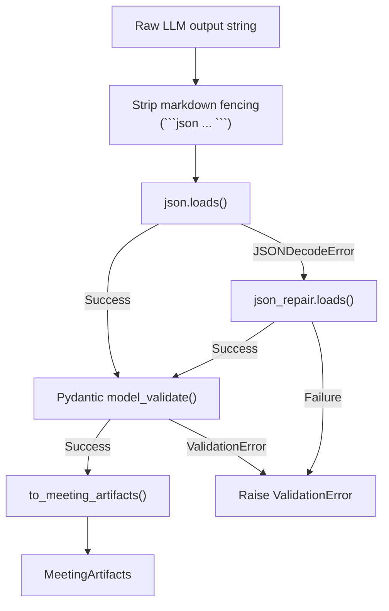

The `strip_markdown_fencing()` function handles the common case where LLMs wrap their JSON output in triple-backtick code blocks. The `json_repair` library corrects structural defects such as trailing commas, single-quoted strings, and unescaped newlines within values. Two separate Pydantic model hierarchies exist: `LLMExtractionResponse` (permissive, matching the LLM's output schema) and `MeetingArtifacts` (strict, canonical). The `to_meeting_artifacts()` function performs the mapping.

### 4.8 Temperature Fallback Strategy

When the LLM fails to produce valid JSON on the first attempt, the extraction retries with a lower temperature to reduce output randomness.

```
temperatures ← [0.1, 0.0]
FOR EACH temp IN temperatures:
    response ← llm_provider.call(prompt, temperature=temp)
    TRY:
        validated ← validate_llm_response(response)
        RETURN validated
    CATCH ValidationError:
        CONTINUE
RAISE ExtractionError("All attempts failed")
```

Temperature 0.1 provides slight diversity for the initial attempt. Temperature 0.0 forces the model into its most deterministic mode for the retry, maximising the probability of structurally valid JSON.

### 4.9 PostgreSQL Job Queue (SKIP LOCKED)

The job queue eliminates the need for an external broker by using PostgreSQL's row-level locking.

**Claim Algorithm:**

```sql
SELECT id FROM job_records
WHERE
    (status = 'pending')
    OR (status = 'processing' AND locked_at < NOW() - INTERVAL '7200 seconds')
    OR (status = 'failed' AND attempts < max_retries AND next_retry_at <= NOW())
ORDER BY created_at ASC
LIMIT 1
FOR UPDATE SKIP LOCKED
```

This single query handles three job sources atomically:
1. **New jobs** in `pending` state.
2. **Stale-locked jobs** where a worker died mid-processing (lock older than 2 hours).
3. **Retriable jobs** that previously failed but have not exhausted their retry budget and whose next-retry timestamp has elapsed.

The `SKIP LOCKED` clause ensures that concurrent workers never contend on the same row. After claiming, the worker updates `status='processing'`, `locked_at=NOW()`, and `locked_by=worker_id`.

**Retry with exponential backoff:**

```
FUNCTION mark_job_failed(job_id, error):
    job.attempts += 1
    IF job.attempts < job.max_retries:
        delay ← 30 × 2^(job.attempts - 1)    // 30s, 60s, 120s
        job.status ← 'failed'
        job.next_retry_at ← NOW() + delay
    ELSE:
        job.status ← 'failed'
        job.error ← error
```

---

## 5. System Interaction and Behaviour

### 5.1 End-to-End Upload and Processing Sequence

The following sequence diagram traces a complete user interaction from audio upload through artefact display.

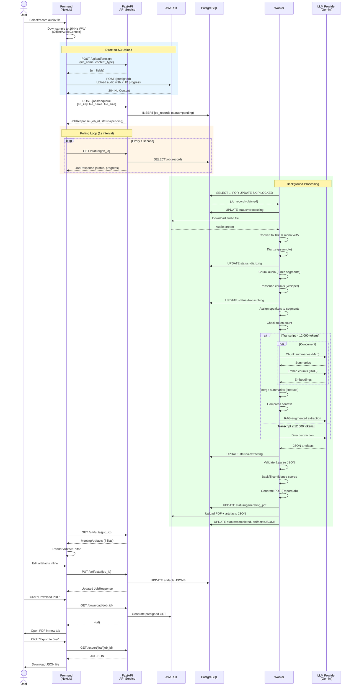

### 5.2 Data Flow Diagram

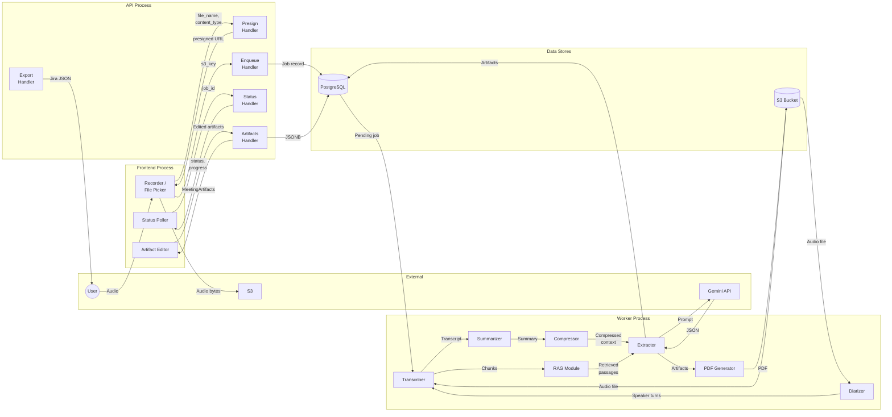

### 5.3 Worker State Machine

Each job transitions through a well-defined state machine. The `ProcessingStatus` enum encodes seven states.

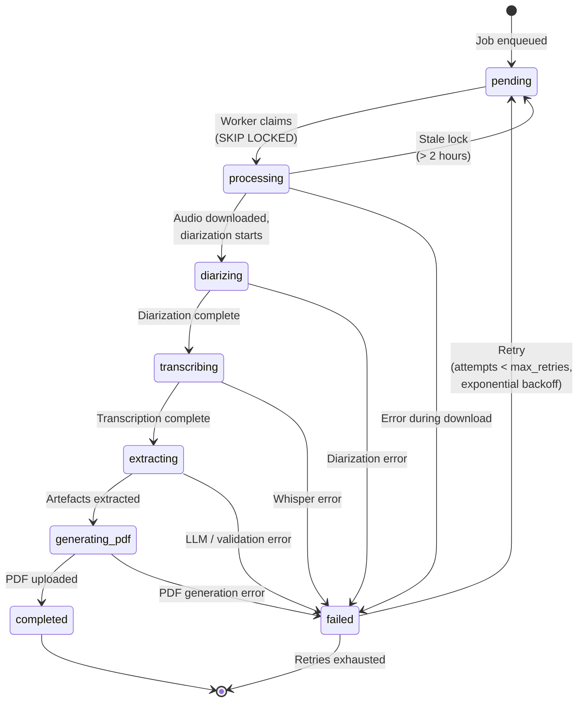

### 5.4 Presigned Upload Flow

The direct-to-S3 upload pattern decouples large binary transfers from the API container, preventing memory exhaustion and request timeouts.

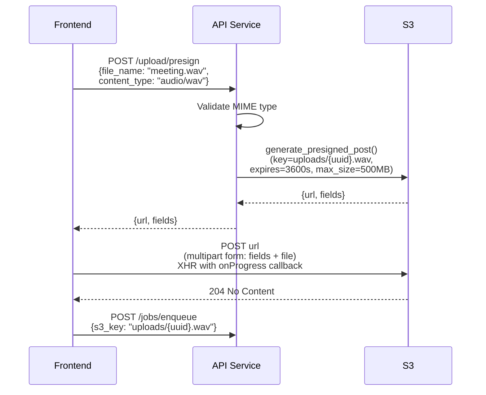

The frontend uses `XMLHttpRequest` rather than `fetch()` to obtain upload progress events via the `onprogress` callback, enabling a real-time progress bar during the S3 transfer.

### 5.5 Frontend Polling and State Transitions

The frontend uses a 1-second polling interval against `GET /status/{job_id}`. A consecutive-error counter (maximum: 30) prevents infinite polling on network failures.

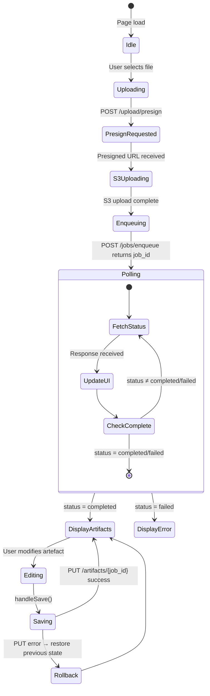

---

## 6. GUI Design

### 6.1 Component Hierarchy

The frontend is organised as a single-page application with conditionally rendered panels. The component tree reflects the linear workflow: record/upload → wait → review/edit → export.

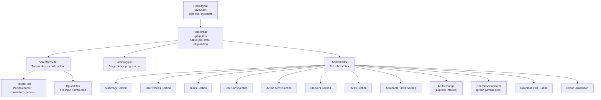

### 6.2 Page Layout and Navigation Flow

Meetolog uses a single-page design with no routes. The visible panel is determined by the current application state:

| Application State | Visible Components | User Actions |
|---|---|---|
| **Idle** (no job) | `VoiceRecorder` | Record audio, upload file |
| **Uploading** | `VoiceRecorder` (disabled) + progress overlay | Wait |
| **Processing** | `JobProgress` | Watch progress stages |
| **Completed** | `ArtifactEditor` | Edit artefacts, download PDF, export Jira JSON |
| **Failed** | Error banner + `VoiceRecorder` | Retry with new file |

### 6.3 Voice Recorder Component

The `VoiceRecorder` component provides two input modes via a tabbed interface:

**Record mode:**
- Requests microphone permission via `navigator.mediaDevices.getUserMedia()`.
- Captures audio using the `MediaRecorder` API with `audio/webm` MIME type.
- Renders a real-time waveform visualisation using an `AnalyserNode` connected to a `<canvas>` element.
- On stop, converts the WebM blob to a 16 kHz mono WAV file using `OfflineAudioContext` downsampling (client-side, in `lib/audio.ts`).
- Passes the resulting `File` object to `onFileReady()`.

**Upload mode:**
- Accepts audio files via `<input type="file" accept="audio/*">`.
- Applies the same `downsampleFile()` preprocessing before passing the file upstream.

### 6.4 Job Progress Component

The `JobProgress` component displays a horizontal stage indicator with six dots corresponding to the processing stages:

```
Uploading → Diarizing → Transcribing → Extracting → Generating PDF → Completed
```

Each dot transitions through three visual states: **pending** (gray), **active** (pulsing blue), and **complete** (solid green). A progress bar beneath shows the numeric percentage reported by the backend. The `PROGRESS_MAPPING` constant maps each `ProcessingStatus` enum value to an expected progress range, enabling smooth visual interpolation.

### 6.5 Artefact Editor Component

The `ArtifactEditor` is the primary interaction surface after processing completes. It renders all seven artefact categories as collapsible sections, each containing an array of inline-editable cards.

**Per-artefact card features:**
- All text fields are rendered as `<input>` or `<textarea>` elements bound to local state.
- `ArtifactBadge` displays the artefact source: "Explicit" (directly stated in the meeting) or "Inferred" (deduced by the LLM).
- `ConfidenceIndicator` renders a coloured bar: green (≥ 0.8), amber (≥ 0.5), red (< 0.5), gray (N/A).
- List fields (acceptance criteria, stakeholders) support add/remove operations via `addListItem()` and `removeListItem()`.
- Delete button removes the artefact from the local array.

**Save mechanism:**
- `handleSave()` performs client-side validation (required fields check).
- On validation pass, sends `PUT /artifacts/{job_id}` with the full `MeetingArtifacts` object.
- Uses **optimistic update with rollback**: a snapshot of the previous state is captured before the save. If the API call fails, the snapshot is restored and a toast notification informs the user.

**Export actions:**
- "Download PDF" triggers `GET /download/{job_id}` and opens the returned presigned URL in a new browser tab.
- "Export to Jira" triggers `GET /export/jira/{job_id}` and initiates a JSON file download via a dynamically created `<a>` element with a `Blob` URL.

### 6.6 Styling Strategy

All components use CSS Modules (`.module.css` files imported as `styles`). This approach provides:

- **Scoped class names** — no global pollution or naming collisions.
- **Co-located styles** — each component's CSS lives adjacent to its TSX file.
- **Zero runtime cost** — class-name hashing occurs at build time.

No external CSS framework (Tailwind, Bootstrap, etc.) is used. The colour scheme uses a neutral base with accent colours for interactive elements and the confidence-indicator palette.

### 6.7 Backend Connection Architecture

The frontend communicates with the backend exclusively through the `/api/*` proxy configured in `next.config.js`:

```javascript
async rewrites() {
    return [
        {
            source: '/api/:path*',
            destination: `${backendUrl}/:path*`,
        },
    ];
}
```

where `backendUrl` defaults to `http://localhost:8000` in development and points to the ALB endpoint in production. This proxy pattern:

- Eliminates CORS issues during development.
- Keeps the backend URL private from the browser.
- Allows Vercel's edge network to route API traffic to the AWS ALB.

The `lib/api.ts` module wraps all HTTP interactions in typed functions (`getPresignedUploadUrl`, `uploadToS3WithProgress`, `enqueueJob`, `getJobStatus`, `updateArtifacts`), ensuring type safety between the frontend and backend schemas.

---

## Appendix A: Environment Variables

The following table lists all configurable parameters read by the backend's `Settings` class:

| Variable | Default | Description |
|---|---|---|
| `LLM_PROVIDER` | `"gemini"` | Active LLM backend (`gemini` or `openai`) |
| `GEMINI_API_KEY` | — | Google Generative AI API key |
| `OPENAI_API_KEY` | — | OpenAI API key |
| `GEMINI_MODEL` | `"gemini-2.5-flash-lite"` | Gemini model identifier |
| `OPENAI_MODEL` | `"gpt-4o-mini"` | OpenAI model identifier |
| `WHISPER_MODEL` | `"tiny"` | Whisper model size |
| `HF_TOKEN` | — | HuggingFace token (pyannote gated model) |
| `ENABLE_DIARIZATION` | `true` | Toggle speaker diarisation |
| `DATABASE_URL` | — | PostgreSQL connection string |
| `AWS_S3_BUCKET` | — | S3 bucket name |
| `AWS_REGION` | — | AWS region |
| `CORS_ORIGINS` | `"*"` | Allowed CORS origins |
| `HIERARCHICAL_TOKEN_THRESHOLD` | `12000` | Token count triggering hierarchical mode |
| `HIERARCHICAL_CHUNK_MAX_TOKENS` | `6000` | Maximum tokens per chunk |
| `HIERARCHICAL_CHUNK_OVERLAP` | `200` | Overlap tokens between chunks |
| `HIERARCHICAL_MAX_SUMMARY_TOKENS` | `12000` | Maximum token budget for merged summary |
| `HIERARCHICAL_CONCURRENCY` | `3` | Maximum concurrent chunk summarisation calls |
| `COMPRESSION_ENABLED` | `true` | Toggle context compression |
| `COMPRESSION_TOKEN_BUDGET` | `8000` | Token budget for compressed output |
| `RAG_CHUNK_SIZE` | `1500` | Token size for RAG chunks |
| `RAG_CHUNK_OVERLAP` | `100` | Overlap between RAG chunks |
| `RAG_TOP_K` | `5` | Number of passages retrieved per query |
| `RAG_MAX_CONTEXT_TOKENS` | `3000` | Maximum tokens per retrieval result |
| `RAG_BATCH_SIZE` | `64` | Embedding batch size |
| `RAG_BACKEND` | `"memory"` | RAG storage backend (`memory` or `pgvector`) |
| `TEST_MODE` | `false` | Enable mock services for testing |

## Appendix B: Prompt Template Architecture

The system uses six prompt domains, each defined as a template string in `core/prompts.py`:

1. **`CHUNK_SUMMARIZATION_PROMPT`** — Instructs the LLM to summarise a single transcript chunk while preserving decisions, owners, dates, action items, and technical details. Used during the Map phase of hierarchical summarisation.

2. **`MERGE_SUMMARIZATION_PROMPT`** — Instructs the LLM to merge multiple chunk summaries into a cohesive whole, resolving contradictions and deduplicating repeated items. Used during the Reduce phase.

3. **`build_extraction_prompt(transcript, schema)`** — Constructs the main extraction prompt. Includes a role persona ("Senior Scrum Master and Business Analyst"), detailed instructions for each artefact type, a few-shot example, the JSON schema, and anti-hallucination safeguards ("Only extract information explicitly stated or strongly implied").

4. **`RAG_AUGMENTED_EXTRACTION_CONTEXT`** — Template for augmenting the extraction prompt with retrieved passages. Inserts per-category context blocks between the summary and the extraction instructions.

5. **`build_task_detection_prompt(text)`** — Specialised prompt for detecting tasks within a text segment. Used for targeted re-extraction when initial results are sparse.

6. **`build_decision_detection_prompt(text)`** — Specialised prompt for detecting decisions. Parallel to task detection.

All prompts enforce JSON-only output, explicitly prohibit markdown fencing, and include the expected schema structure to guide the LLM's response format.

---

*End of Sprint 3 – System Design Report*
